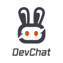

 

 

# DevChat Visual Studio Code Extension

 

👉 Install [Visual Studio Code extension](https://github.com/devchat-ai/devchat-vscode) from [Visual Studio Marketplace](https://marketplace.visualstudio.com/items?itemName=merico.devchat) and enjoy DevChat 👏

  
***

## What is DevChat?

DevChat is an open-source platform that empowers developers to leverage AI for code generation and documentation. We aim to go beyond simple code auto-completion and limited operations on code snippets. DevChat offers a highly *practical* and *effective* way for developers to interact and collaborate with large language models (LLMs).

## Our Insights

While there are many AI coding tools available, we created DevChat based on our insights gained from generating tens of thousands of lines of code. If you agree with our perspectives outlined below, DevChat could be the perfect choice for you.

- **The value of prompt "engineering" is often overstated**. While a well-crafted prompt template can be beneficial, it doesn't justify spending days or weeks of study. Instead, dedicate an hour or two to create a few effective templates and share them with your team.
- The art of writing prompts is a skill honed through practice. It's not about templates or engineering, but about **refining individual prompts for specific tasks on a case-by-case basis**.
- **The bottleneck in harnessing AI's capabilities lies in how to embed the right context in a prompt**. This isn't merely about the token limit of an AI model's input. Even with an infinite number of tokens, existing AI models would struggle to yield satisfactory results without a proper separation of concerns.
- **Use AI only when it truly adds value**. Our misconception about AI's capabilities in reality is even a greater issue than hallucination of LLMs. What we need is a tool that boosts productivity, not merely an experiment.

## Our Features

In alignment with our insights, DevChat incorporates the following design choices:
- **Precise control over the context embedded in a prompt**. This isn't a feature to be overlooked in the quest for greater intelligence or autonomy. Precise control over context is crucial for effective AI use. In our view, most other tools tend to over-guess what a user needs to put into the context of a prompt. This typically introduces more noise than the Claude model it utilizes can effectively manage.
- **A simple, extensible prompt directory**. This allows developers or teams to easily integrate their own predefined prompt snippets into DevChat, avoiding significant engineering effort or a steep learning curve. You don't need [LangChain](https://github.com/langchain-ai/langchain) to make AI work for you.

### Context Building

Great output requires great input, to maximize the power of AI, DevChat assists you seamlessly to **provide the right context** to the AI.

- The most fundamental operation involves selecting code (either files or snippets) and adding it to DevChat. For instance, you can add a function along with an existing test case to the prompt context, and ask DevChat to generate several test cases for the function. The test case serves as a useful reference for DevChat, enabling it to understand how to write a valid test case in your environment, thus eliminating the need for you to specify every requirement or setup in your prompt.

    

- You can incorporate the output of any command, such as `tree ./src`, into a prompt with DevChat. For example, you can add the output of `git diff --cached` to DevChat, which can then generate a commit message for you.

    

- Program analysis can assist in building the necessary context. Suppose you want DevChat to explain some code to you. DevChat can perform better if it's aware of the dependent functions that the code calls. In this scenario, you select the target code to explain and add "symbol definitions" to the context. DevChat will then generate a prompt that explains the target code, taking into account the dependent functions.

### Prompt Extension
  
  

    

Once you have generated code with AI, DevChat **streamlines the actions** to properly integrate and ship.
  
  View diffs, copy or insert, commit & sync, or export to documentation, wikis, and more.
  
  

***

## Quick Start

> Chinese: [中文安装配置指南](https://zh.devchat.blog/devchat-vscode-installation-guide).

  - Install [Visual Studio Code](https://code.visualstudio.com/download).
  - Open the Extensions view (⇧⌘X), search for DevChat, and install the extension:
  
  &nbsp; &nbsp; 

  - Be sure to open a Git or SVN project.
  - Set your [OpenAI API Key](https://platform.openai.com/account/api-keys) by running `export OPENAI_API_KEY="[sk-...]"` (or set it to your DevChat access key instead).
  - Click on the DevChat icon in the status bar. If the API key setting is not configured, it will prompt you to enter it. Simply input the key.

  &nbsp; &nbsp; 

  - We recommend dragging the DevChat logo from the left sidebar to **the right sidebar** to avoid overlapping with the Explorer.

## Community

- Join our [Discord](https://discord.gg/9t3yrbBUXD)!
- Participate in [discussions](https://github.com/devchat-ai/devchat/discussions)!

## What is Prompt-Centric Software Development (PCSD)?

- The traditional code-centric paradigm is evolving.

- Write prompts to create code. Transform prompts into all the artifacts in software engineering.

  

  (This image is licensed by devchat.ai under a <a rel="license" href="http://creativecommons.org/licenses/by-sa/4.0/">Creative Commons Attribution-ShareAlike 4.0 International License</a>.)
  
- We like to call it DevPromptOps
  
  
  
  (This image is licensed by devchat.ai under a <a rel="license" href="http://creativecommons.org/licenses/by-sa/4.0/">Creative Commons Attribution-ShareAlike 4.0 International License</a>.)

## Contributing

Issues and pull request are welcome: 
- https://github.com/devchat-ai/devchat/issues
- https://github.com/devchat-ai/devchat-vscode/pulls

## Contact Information
  
hello@devchat.ai

We are creators of [Apache DevLake](https://devlake.apache.org/).
